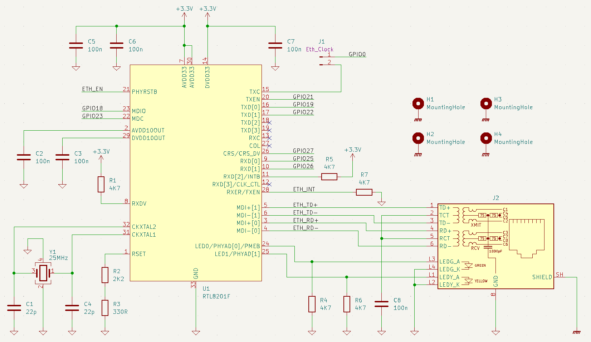

# Ethernet am ESP32 mit Micropython

Der Ethernet-Treiber besteht aus zwei Teilen: dem MAC- und dem PHY-Controller.

Der ESP32 enthält bereits einen MAC-Controller, sodass nur noch ein PHY-Controller benötigt wird, um Ethernet am ESP32 zu nutzen. Für einige PHY-Controller gibt es im ESP-IDF bereits eine API, die auch in MicroPython verfügbar ist. Konkret sind das die PHY-Controller:

 - DP83848
 - IP101
 - LAN8720
 - RTL8201

Für die Kommunikation zwischen MAC und PHY wird das MII (Media Independent Interface) bzw. RMII (Reduced Media Independent Interface) genutzt. Das MII besteht aus: 
 - Transmitter Signals:
   - TXC (Transmit Clock)
   - TXD0-3 (Transmit Data Bit 0-3)
   - TXEN (Transmit Enable)
   - TXER (Transmit Error)
 - Receiver Signals:
   - RXC (Receive Clock)
   - RXD0-3 (Receive Data Bit 0-3)
   - RXDV (Receive Data Valid)
   - RXER (Receive Error)
   - CRS (Carrier Sense)
   - COL (Collision Detect)
 - Management Signals:
   - MDIO (Management Data)
   - MDC (Management Data Clock)

Das beim RMII entfallen einige Signale:
 - Transmit und Receive Clock werden durch ein Signal ersetzt (REF_CLK)
 - die Clock-Frequenz wird von 25 auf 50 MHz angehoben, dafür werden nur 2 statt 4 Transmit bzw. Receive Data Bits benötigt
 - RXDV und CRS werden gemultiplexed
 - COL wird komplett entfernt

Damit ist die Anzahl der benötigten Pins von 18 auf 9 reduziert.

Ich habe nachfolgend eine Schaltung mit dem RTL8201 erstellt. Dieser Chip ist bei JLCPCB verfügbar. Hier meine Überlegungen zum Anschluss:

## MII/RMII Interface

Im Beispiel stellt der PHY das Clock-Signal zur Verfügung. Das ist in der aktuellen MicroPython-Version (19.1) die einzige Möglichkeit. Dieses Signal muss dann zu GPIO 0 am ESP32 geführt werden. Über GPIO 0 wird aber auch der Boot-Modus gewählt. Daher sollte der PHY (und damit auch das Clock-Signal) erst nach dem Boot-Vorgang gestartet werden. Dies kann über den Pin PHYRSTB am PHY gesteuer werden.

Pin RTL8201 | Richtung | Anschluss          | Erklärung 
------------|----------|--------------------|----------
TXC         | Out      | GPIO 0             | Transmit Clock (Reference Clock), wird vom PHY zur Verfügung gestellt
TXEN        | In       | GPIO 21            | Transmit Enable, festgelegt, nicht änderbar
TXER        | In       | -                  | Transmit Error, für RMII nicht benötigt
TXD[0]      | In       | GPIO 19            | Transmit Data, festgelegt, nicht änderbar
TXD[1]      | In       | GPIO 22            | Transmit Data, festgelegt, nicht änderbar
TXD[2]      | In       | -                  | Transmit Data, für RMII nicht benötigt
TXD[3]      | In       | -                  | Transmit Data, für RMII nicht benötigt
RXC         | Out      | -                  | Receive Clock, für RMII nicht benötigt
COL         | Out      | -                  | Collision Detected, für RMII nicht benötigt
CRS         | In/Out   | GPIO 27            | Carrier Sense, festgelegt, nicht änderbar
RXDV        | Out      | 4.7kOhm PullUp     | Receive Data Valid, für RMII nicht benötigt
RXD[0]      | Out      | GPIO 25            | Receive Data, festgelegt, nicht änderbar
RXD[1]      | Out      | GPIO 26            | Receive Data, festgelegt, nicht änderbar
RXD[2]/INTB | Out      | GPIO x             | Receive Data, für RMII nicht benötigt, alternativ Interrupt, wenn sich Linkstatus ändert (noch nicht getestet)
RXD[3]      | Out      | -                  | Receive Data, für RMII nicht benötigt
RXER        | Out      | 4.7kOhm PullDown   | Receive error, für RMII nicht benötigt

## Serial Management

Pin RTL8201 | Richtung | Anschluss          | Erklärung 
------------|----------|--------------------|----------
MDC         | In       | GPIO 23            | Management Data Clock, default, änderbar
MDIO        | In/Out   | GPIO 18            | Management Data Input/Output, default, änderbar

## Clock

Pin RTL8201 | Richtung | Anschluss          | Erklärung 
------------|----------|--------------------|----------
X1          | In       | 25MHz Crystal      | Crystal
X2          | Out      | 25MHz Crystal      | Crystal

## Network Interface

Pin RTL8201 | Richtung | Anschluss          | Erklärung 
------------|----------|--------------------|----------
MDI+[0]     | In/Out   | Netzwerkbuchse     | Transmit Output
MDI-[0]     | In/Out   | Netzwerkbuchse     | Transmit Output
MDI+[1]     | In/Out   | Netzwerkbuchse     | Receive Input
MDI-[1]     | In/Out   | Netzwerkbuchse     | Receive Input
LED0        | Out      | Netzwerkbuchse     | Konfigurierbar, siehe Datenblatt
LED1        | Out      | Netzwerkbuchse     | Konfigurierbar, siehe Datenblatt

## Versorgung und Reset

Pin RTL8201 | Richtung | Anschluss                  | Erklärung 
------------|----------|----------------------------|----------
PHYRSTB     | In       | GPIO x, 10kOhm PullDown    | Enable, siehe Erklärung unter MII/RMII-Interface



Hinweis zum Shield-Pin: Nach meinen Nachforschungen soll die Schirmung des Steckers mit dem Gehäuse verbunden werden. Ich mache das hier über die Befestigungsbohrungen.

[https://docs.espressif.com/projects/esp-idf/en/latest/esp32/api-reference/network/esp_eth.html](https://docs.espressif.com/projects/esp-idf/en/latest/esp32/api-reference/network/esp_eth.html)

[https://github.com/espressif/esp-idf/tree/master/examples/ethernet](https://github.com/espressif/esp-idf/tree/master/examples/ethernet)

[https://en.wikipedia.org/wiki/Media-independent_interface](https://en.wikipedia.org/wiki/Media-independent_interface)

[https://electronics.stackexchange.com/questions/215138/how-to-connect-usb-ethernet-shields-to-chassis-or-digital-grounds](https://electronics.stackexchange.com/questions/215138/how-to-connect-usb-ethernet-shields-to-chassis-or-digital-grounds)

# MicroPython Code

Hier ein kurzes Beispiel, wie das Ethernet-Interface in MicroPython aktiviert wird:

```
import machine
import network
import time

l = network.LAN(mdc = machine.Pin(23), mdio = machine.Pin(18), phy_type = network.PHY_RTL8201, phy_addr=0)
l.active(True)
print("Eth interface active")

old_state = l.status()
while(True):
    if old_state != l.status():
        if l.status() == network.ETH_CONNECTED:
            print("ETH_CONNECTED")
        if l.status() == network.ETH_DISCONNECTED:
            print("ETH_DISCONNECTED")
        if l.status() == network.ETH_GOT_IP:
            print("ETH_GOT_IP")
        if l.status() == network.ETH_INITIALIZED:
            print("ETH_INITIALIZED")
        if l.status() == network.ETH_STARTED:
            print("ETH_STARTED")
        if l.status() == network.ETH_STOPPED:
            print("ETH_STOPPED")
        old_state = l.status()
    time.sleep(0.1)
```