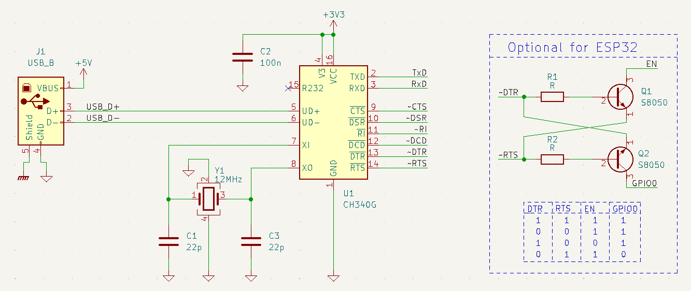

# USB-to-Serial Converter

In vielen elektronischen Schaltungen im Hobby-Bereich wird UART genutzt und der CH340G ist ein weit verbreiteter, günstiger IC, der eine Serielle Schnittstelle per USB zur Verfügung stellt. 

Ich habe hier einmal versucht, die Begriffe auseinanderzuhalten, allerdings ist das gar nicht so einfach:

## UART

Steht für Universal Asynchronus Receiver/Transmitter. In diesem Protokoll werden Regeln definiert, wie serielle Daten zwischen Sender und Empfänger ausgetauscht werden. Es werden für zwei Datenleitungen (Tx, Rx) verwendet. Die Tx (Transmit)-Leitung des Senders muss mit der Rx (Receive)-Leitung des Empfängers verbunden werden. Spannungspegel sind nicht vorgeschrieben, allerdings sind 3,3 bzw. 5V üblich.

Die Daten werden in Rahmen (Frames) übertragen. Da es kein gemeinsames Taktsignal gibt, müssen beide Teilnehmer vorher auf die gleiche Datenrate (Baudrate) eingestellt werden. Weiterhin müssen Einstellungen zu Start-/Stop-Bits, Paritätsbits und Anzahl der Datenbits getroffen werden.

## RS232

RS232 ist an UART angelehnt, aber noch ein bisschen mehr. RS232 war ursprünglich für die Kommunikation mit einem Modem gedacht. Das Mehr gegenüber UART ist unter anderem:

 - Spannungen sind definiert:
   - -15 V bis -3 V sind eine logische 1
   - 3 V bis 15 V sind eine logische 0
 - es gibt neben den beiden Datenleitungen noch Steuerleitungen:
   - DCD, Data Carrier Detect
   - DTR, Data Terminal Ready
   - DSR, Data Set Ready
   - RTS, Request to Send
   - CTS, Clear to Send
   - RI, Ring Indicator

[https://de.wikipedia.org/wiki/RS-232](https://de.wikipedia.org/wiki/RS-232)

## CH340G

Der CH340G ist ein USB-to-UART-Converter, unterstützt aber weitere Modem-Signale. 

Pin CH340G | Richtung | Erklärung 
-----------|----------|-----------
VCC        | Power    | 3,3V oder 5V, 100nF Kondensator, Versorgungsspannung entspricht IO-Spannung
V3         | Power    | Bei VCC=3,3V: mit VCC verbinden, bei VCC=5V: mit 100nF Kondensator verbinden
GND        | Power    |  
XI, XO     | Clock    | 12MHz Quarz
TXD        | Out      | Transmit
RXD        | In       | Receive
~CTS       | In       | Clear to Send (active low)
~DSR       | In       | Data Set Ready (active low)
~RI        | In       | Ring Indicator (active low)
~DCD       | In       | Data Carrier Detect (active low)
~DTR       | Out      | Data Terminal Ready (active low)
~RTS       | Out      | Request to Send (active low)
RS232      | In       | Zusätzliche RS232 Funktionalität aktivieren (high), z.B. Rx-Pin invertieren

[https://www.mpja.com/download/35227cpdata.pdf](https://www.mpja.com/download/35227cpdata.pdf)

